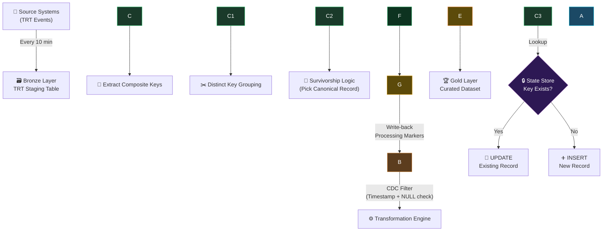

<div align="center">

# 🔄 Near Real-Time Incremental ETL \& Deduplication Pipeline

### A stateful, idempotent ETL pipeline with CDC-style filtering, composite-key deduplication, survivorship logic, and audit traceability — running in production on 10-minute micro-batch cycles.


[Architecture](#-architecture-overview) •
[Pipeline Deep Dive](#-pipeline-deep-dive) •
[Design Decisions](#-design-decisions--trade-offs) •
[Scalability](#-scalability-roadmap) •
[Tech Stack](#-tech-stack) •
[Setup](#-how-to-deploy) •
[Author](#-author)

</div>


## 📑 Table of Contents

* [Architecture Overview](#-architecture-overview)
* [Problem Statement](#-problem-statement)
* [Key Features](#-key-features)
* [Pipeline Deep Dive](#-pipeline-deep-dive)

  * [Stage 1: Orchestration](#stage-1--orchestration-layer)
  * [Stage 2: Ingestion / Bronze Layer](#stage-2--ingestion--bronze-layer)
  * [Stage 3: CDC Filtering](#stage-3--change-data-capture-cdc-filtering)
  * [Stage 4: Transformation Engine](#stage-4--transformation-engine)
  * [Stage 5: State Management](#stage-5--state-management--idempotency)
  * [Stage 6: Load / Upsert](#stage-6--load--upsert-curated--gold-layer)
  * [Stage 7: Audit \& Observability](#stage-7--audit--observability)
* [Data Flow Diagram](#-data-flow-diagram)
* [Design Decisions \& Trade-offs](#-design-decisions--trade-offs)
* [Error Handling \& Recovery](#-error-handling--recovery)
* [Scalability Roadmap](#-scalability-roadmap)
* [Tech Stack](#-tech-stack)
* [Folder Structure](#-folder-structure)
* [How to Deploy](#-how-to-deploy)
* [Patterns \& Skills Demonstrated](#-patterns--skills-demonstrated)
* [Future Enhancements](#-future-enhancements)
* [Author](#-author)
* [License](#-license)

\---

## 🏗 Architecture Overview

```
┌─────────────────────────────────────────────────────────────────────┐
│                    ARCHITECTURE: MEDALLION PATTERN                  │
│                                                                     │
│   ┌───────────────────────┐                                        │
│   │  📡 Source Systems     │  TRT operational events                │
│   │     (TRT Events)      │                                        │
│   └──────────┬────────────┘                                        │
│              │ ⏱ Every 10 min (Scheduled Trigger)                  │
│              ▼                                                      │
│   ┌───────────────────────┐                                        │
│   │  🗃️ BRONZE LAYER       │  Raw staging table (SharePoint Excel) │
│   │  TRT Staging Table    │  ◄──── Write-back Processing Markers   │
│   └──────────┬────────────┘          (Audit Trail) 📝              │
│              │ 🔍 CDC Filter                                       │
│              │ (Timestamp + DEDUP\_PROCESSED\_TIME IS NULL)           │
│              ▼                                                      │
│   ┌───────────────────────┐                                        │
│   │  ⚙️ TRANSFORMATION     │                                       │
│   │  ▸ Composite Key      │                                        │
│   │  ▸ Distinct Grouping  │                                        │
│   │  ▸ Survivorship Logic │                                        │
│   └──────────┬────────────┘                                        │
│              │ 🔎 Lookup                                           │
│              ▼                                                      │
│   ┌───────────────────────┐                                        │
│   │  🔒 STATE STORE        │  Dedupe table (idempotency check)     │
│   │  Dedupe Table         │  ◄──── Self-loop: Key exists?          │
│   └──────┬───────┬────────┘                                        │
│          │       │                                                  │
│    ┌─────┘       └─────┐                                           │
│    ▼ UPDATE        INSERT ▼                                        │
│   ┌───────────────────────┐                                        │
│   │  🏆 GOLD LAYER         │  Curated, analytics-ready dataset     │
│   │  Deduplicated Output  │                                        │
│   └───────────────────────┘                                        │
│                                                                     │
└─────────────────────────────────────────────────────────────────────┘
```

\---

## ❓ Problem Statement

### The Challenge

Operational TRT (Technical Response Team) events are continuously ingested into a staging table. Without proper deduplication:

|Problem|Impact|
|-|-|
|**Duplicate records** flood downstream systems|❌ Inflated metrics, incorrect reporting|
|**Full-table rescans** on every run|❌ High latency, API throttling|
|**No processing state** tracking|❌ Re-processing same records, wasted compute|
|**No audit trail**|❌ Compliance risk, impossible failure analysis|
|**No canonical record** selection|❌ Conflicting data for same entity|

### The Solution

A **stateful, near real-time ETL pipeline** that:

✅ Processes only **new/unprocessed records** (CDC pattern)
✅ Deduplicates using **composite business keys**
✅ Selects **canonical records** via survivorship logic
✅ Guarantees **idempotent writes** (exactly-once semantics)
✅ Maintains a complete **audit trail** with processing markers

\---

## ✨ Key Features

|Feature|Engineering Pattern|Why It Matters|
|-|-|-|
|⏱ 10-min micro-batches|Near real-time orchestration|Low-latency without API throttling|
|🔍 Timestamp-based filtering|Change Data Capture (CDC)|Eliminates full-table scans|
|🔑 Composite business key|Business key modeling|Deterministic entity identity|
|👑 Pick canonical record|Survivorship / Entity resolution|Golden record for each entity|
|🔒 Dedupe table lookup|State store + idempotency|Exactly-once processing guarantee|
|🔄 Conditional update/insert|Upsert (MERGE) strategy|Clean curated output|
|📝 Write-back timestamps|Processing markers|Audit trail + replay avoidance|
|🛡️ Auto-retry on failure|Built-in fault tolerance|Unprocessed rows retry next cycle|

\---

## 🔬 Pipeline Deep Dive

### Stage 1 — Orchestration Layer

```
┌────────────────────────────────────────────┐
│  ⏱ Scheduled Trigger (Recurrence)          │
│  Frequency: Every 10 minutes               │
│  Pattern: Time-based micro-batch           │
└────────────────────────────────────────────┘
```

**What it does:**

* Triggers the entire pipeline on a fixed 10-minute schedule
* Enables near real-time data freshness without event-driven complexity

**DE Concept:** *Pipeline Orchestration* — equivalent to cron jobs, Airflow DAG schedules, or ADF triggers

**Design Choice:**

> "10-minute micro-batches balance data freshness against SharePoint API rate limits. For sub-second latency, I'd migrate to event-driven with Service Bus or Kafka."

\---

### Stage 2 — Ingestion / Bronze Layer

```
┌────────────────────────────────────────────┐
│  🗃️ List Rows FROM TRT Staging Table        │
│  Source: SharePoint Excel Online            │
│  Role: Raw ingestion layer (Bronze)         │
└────────────────────────────────────────────┘
```

**What it does:**

* Reads all rows from the TRT Staging Table hosted on SharePoint
* Acts as the **source-of-truth ingestion layer** (Bronze in medallion architecture)

**DE Concept:** *Source System Ingestion* — equivalent to reading from databases, APIs, or message queues

**Key Detail:**

> The staging table contains raw operational events with fields like `TRT RECEIVED DATE`, `CompositeKey`, `DEDUP\_PROCESSED\_TIME`, and business attributes.

\---

### Stage 3 — Change Data Capture (CDC) Filtering

```
┌────────────────────────────────────────────┐
│  🔍 Filter Array                            │
│  Condition 1: TRT RECEIVED DATE matches     │
│  Condition 2: DEDUP\_PROCESSED\_TIME IS NULL  │
│  Result: Only new/unprocessed records       │
└────────────────────────────────────────────┘
```

**What it does:**

* Filters rows where `DEDUP\_PROCESSED\_TIME` is empty (not yet processed)
* Additionally filters by `TRT RECEIVED DATE` for time-based scoping
* **Eliminates full-table reprocessing** on every pipeline run

**DE Concept:** *Change Data Capture (CDC)* — equivalent to reading database change logs, using watermarks, or tracking offsets

**Why this matters:**

```
Without CDC:  Every run processes ALL rows     → O(n) every cycle  ❌
With CDC:     Each run processes only NEW rows  → O(Δn) per cycle  ✅
```

\---

### Stage 4 — Transformation Engine

```
┌────────────────────────────────────────────┐
│  ⚙️ Transformation Engine                   │
│                                             │
│  Step 4a: Select CompositeKey columns       │
│  Step 4b: Create DISTINCT key list          │
│  Step 4c: For each key → filter \& pick row  │
│           (Survivorship Logic)              │
└────────────────────────────────────────────┘
```

**What it does:**

|Sub-step|Action|DE Pattern|
|-|-|-|
|**4a** — Select Key Columns|Extract only `CompositeKey` from filtered rows|Projection / Column pruning|
|**4b** — Distinct Keys|Deduplicate the key list|`SELECT DISTINCT` / Set-based dedup|
|**4c** — Survivorship Logic|For each unique key, filter related rows and pick the **canonical (authoritative) record**|Entity Resolution / Golden Record|

**DE Concept:** *Entity Resolution + Survivorship* — equivalent to:

```sql
-- Survivorship: Pick the latest record per entity
SELECT \* FROM (
    SELECT \*, ROW\_NUMBER() OVER (PARTITION BY CompositeKey ORDER BY received\_date DESC) AS rn
    FROM staging
) WHERE rn = 1
```

\---

### Stage 5 — State Management \& Idempotency

```
┌────────────────────────────────────────────┐
│  🔒 State Store Check                       │
│                                             │
│  Action: Filter Dedupe Table for key        │
│  Count:  Number of matching records         │
│                                             │
│  Result: Key EXISTS or Key NOT FOUND        │
└────────────────────────────────────────────┘
```

**What it does:**

* For each canonical record, checks if its `CompositeKey` already exists in the **Dedupe Table**
* The Dedupe Table acts as a **persistent state store**
* Prevents duplicate writes across pipeline runs

**DE Concept:** *Idempotency + State Management* — equivalent to:

* Kafka consumer offsets
* Airflow XCom state
* Delta Lake transaction log
* Redis/DynamoDB state stores

**Why this is 3–5 YOE level:**

> "Freshers write append-only pipelines. Mid-level engineers design stateful pipelines with exactly-once guarantees."

\---

### Stage 6 — Load / Upsert (Curated / Gold Layer)

```
┌────────────────────────────────────────────┐
│  🏆 Conditional Load (Upsert)               │
│                                             │
│  IF key exists  → UPDATE existing row       │
│  IF key is new  → INSERT new row            │
│                                             │
│  Target: Dedupe Table (Gold Layer)          │
└────────────────────────────────────────────┘
```

**What it does:**

* **Upsert pattern**: Update if record exists, Insert if new
* Maintains a clean, deduplicated **Gold Layer** dataset
* Downstream dashboards and compliance reports consume from here

**DE Concept:** *MERGE / Upsert Strategy* — equivalent to:

```sql
MERGE INTO gold\_table AS target
USING staging AS source
ON target.CompositeKey = source.CompositeKey
WHEN MATCHED THEN UPDATE SET ...
WHEN NOT MATCHED THEN INSERT ...
```

\---

### Stage 7 — Audit \& Observability

```
┌────────────────────────────────────────────┐
│  📝 Post-Processing Write-back              │
│                                             │
│  Action: Update DEDUP\_PROCESSED\_TIME in     │
│          staging table for processed rows   │
│                                             │
│  Purpose: Replay avoidance + Audit trail    │
└────────────────────────────────────────────┘
```

**What it does:**

* Writes `DEDUP\_PROCESSED\_TIME` back to every processed row in the staging table
* Ensures processed rows are **never picked up again** (CDC filter dependency)
* Creates a full **audit trail** for compliance and failure analysis

**DE Concept:** *Processing Markers + Observability* — equivalent to:

* Checkpoint files in Spark Streaming
* Watermark updates in Flink
* Processed flags in traditional ETL

\---

## 📊 Data Flow Diagram



\---

## ⚖️ Design Decisions \& Trade-offs

|Decision|Chosen Approach|Alternative|Rationale|
|-|-|-|-|
|**Trigger frequency**|10-min micro-batches|Real-time event-driven|Balances freshness vs. API rate limits on SharePoint connector|
|**Incremental strategy**|CDC via processing flag|Full-table scan + diff|O(Δn) per cycle vs. O(n) — significantly reduces compute|
|**Dedup strategy**|Composite business key|Hash-based / probabilistic|Deterministic identity, auditable, business-meaningful|
|**Record selection**|Survivorship (pick canonical)|Keep all versions (SCD Type 2)|Business requirement: one authoritative record per entity|
|**State storage**|Dedicated Dedupe Table|In-memory / no state|Persistence across runs, crash recovery, audit capability|
|**Write pattern**|Upsert (conditional)|Append-only + compact|Simpler downstream consumption, no compaction needed|
|**Audit mechanism**|Write-back timestamp|Separate audit log table|Dual purpose: replay avoidance + audit in single write|
|**Error recovery**|Implicit retry (NULL = unprocessed)|Explicit DLQ / retry queue|Simpler design, self-healing by nature|

\---

## 🛡️ Error Handling \& Recovery

```
┌─────────────────────────────────────────────────────────────────┐
│                    FAULT TOLERANCE DESIGN                        │
│                                                                  │
│  Scenario 1: Pipeline fails mid-run                             │
│  ┌─────────────────────────────────────────────────────────┐    │
│  │ Rows NOT processed → DEDUP\_PROCESSED\_TIME stays NULL    │    │
│  │ Next run → CDC filter picks them up automatically       │    │
│  │ Result: Built-in retry, zero data loss ✅               │    │
│  └─────────────────────────────────────────────────────────┘    │
│                                                                  │
│  Scenario 2: Duplicate event arrives                            │
│  ┌─────────────────────────────────────────────────────────┐    │
│  │ CompositeKey already exists in State Store              │    │
│  │ Pipeline triggers UPDATE (not INSERT)                   │    │
│  │ Result: No duplicates in Gold Layer ✅                  │    │
│  └─────────────────────────────────────────────────────────┘    │
│                                                                  │
│  Scenario 3: SharePoint API throttling                          │
│  ┌─────────────────────────────────────────────────────────┐    │
│  │ Power Automate built-in retry policy handles throttles  │    │
│  │ 10-min interval provides natural backoff window         │    │
│  │ Result: Resilient to transient failures ✅              │    │
│  └─────────────────────────────────────────────────────────┘    │
│                                                                  │
└─────────────────────────────────────────────────────────────────┘
```

\---

## 🚀 Scalability Roadmap

> \*"The orchestration layer is Power Automate, but the architectural patterns — CDC, idempotency, upserts, state stores, survivorship — are directly transferable."\*

### Migration Path

|Current (Power Automate)|Scale Target|Migration Approach|
|-|-|-|
|Recurrence Trigger|**Apache Airflow** DAG / **Azure Data Factory** Trigger|Schedule-based or event-based trigger|
|SharePoint Excel|**Azure SQL** / **Cosmos DB** / **Delta Lake**|Structured storage with proper indexing|
|Filter Array (CDC)|**Watermark queries** / **Change Tracking**|`WHERE modified\_at > last\_checkpoint`|
|Composite Key Logic|**SQL GROUP BY** / **Spark partitionBy**|Hash or composite key in SQL/Spark|
|Survivorship Logic|**ROW\_NUMBER() OVER PARTITION BY**|Window functions for canonical selection|
|Dedupe Table|**Delta Lake** / **Redis** / **DynamoDB**|Persistent state store with TTL|
|Upsert Logic|**MERGE INTO** / **Delta MERGE**|Native database upsert|
|Processing Markers|**Checkpoint files** / **Kafka offsets**|Framework-native state management|

### Architecture at Scale

```
┌──────────────┐     ┌──────────────┐     ┌──────────────┐
│   Kafka /    │     │   Airflow /  │     │  Delta Lake  │
│  Event Hub   │────▸│     ADF      │────▸│  (Gold)      │
│  (Ingest)    │     │ (Orchestrate)│     │              │
└──────────────┘     └──────┬───────┘     └──────────────┘
                            │
                    ┌───────▼───────┐
                    │  Spark / SQL  │
                    │ (Transform +  │
                    │  Dedup)       │
                    └───────────────┘
```

\---

## 🛠 Tech Stack

|Layer|Technology|Role|
|-|-|-|
|**Orchestration**|Power Automate (Cloud)|Pipeline scheduling \& flow control|
|**Source / Bronze**|SharePoint Online + Excel|Raw data staging|
|**Transformation**|Power Automate expressions|CDC filtering, key extraction, survivorship|
|**State Store**|Excel Table (Dedupe Table)|Idempotency \& dedup state|
|**Curated / Gold**|Excel Table (Dedupe Output)|Analytics-ready deduplicated data|
|**Monitoring**|Power Automate Run History|Execution logs \& failure alerts|

\---

## 📁 Folder Structure

```
📦 etl-dedup-pipeline/
│
├── 📄 README.md                          # This file
├── 📄 LICENSE                            # MIT License
│
├── 📂 flow-definitions/
│   ├── 📄 TRT\_Dedup\_Pipeline.zip         # Exported Power Automate flow package
│   └── 📄 flow-definition.json           # Raw flow JSON definition
│
├── 📂 documentation/
│   ├── 📄 architecture-diagram.png       # System design slide
│   ├── 📄 data-flow-diagram.md           # Mermaid diagram source
│   ├── 📄 design-decisions.md            # Detailed trade-off analysis
│   └── 📄 interview-talk-track.md        # 60-second interview script
│
├── 📂 sql-equivalent/
│   ├── 📄 cdc\_filter.sql                 # CDC filtering logic in SQL
│   ├── 📄 survivorship.sql               # Survivorship / ROW\_NUMBER query
│   ├── 📄 upsert\_merge.sql              # MERGE INTO statement
│   └── 📄 full\_pipeline.sql              # Complete pipeline in SQL
│
├── 📂 python-equivalent/
│   ├── 📄 pipeline.py                    # Full pipeline in Python/Pandas
│   ├── 📄 dedup\_engine.py                # Deduplication module
│   └── 📄 state\_manager.py              # State store management
│
├── 📂 tests/
│   ├── 📄 test\_dedup\_logic.py            # Unit tests for dedup
│   ├── 📄 test\_survivorship.py           # Unit tests for survivorship
│   └── 📄 test\_idempotency.py           # Idempotency verification tests
│
└── 📂 config/
    ├── 📄 sharepoint\_config.json         # SharePoint connection settings
    └── 📄 pipeline\_config.yaml           # Pipeline parameters (frequency, filters)
```

\---

## ⚡ How to Deploy

### Prerequisites

* Microsoft 365 account with Power Automate license
* SharePoint Online site with:

  * ✅ TRT Staging Table (Excel workbook with structured table)
  * ✅ Dedupe Table (Excel workbook with structured table)

### Setup Steps

```bash
# Step 1: Clone this repository
git clone https://github.com/cheepururaviteja/etl-dedup-pipeline.git

# Step 2: Import the flow
#   → Go to https://flow.microsoft.com
#   → Click "Import" → Upload flow-definitions/TRT\_Dedup\_Pipeline.zip

# Step 3: Configure connections
#   → Update SharePoint site URL in flow connections
#   → Map Excel table references to your workbooks

# Step 4: Configure the staging table schema
#   Required columns:
#   ┌──────────────────────┬───────────┬─────────────────────────────────┐
#   │ Column Name          │ Type      │ Purpose                         │
#   ├──────────────────────┼───────────┼─────────────────────────────────┤
#   │ CompositeKey         │ Text      │ Business entity identifier      │
#   │ TRT RECEIVED DATE    │ DateTime  │ Event timestamp                 │
#   │ DEDUP\_PROCESSED\_TIME │ DateTime  │ Processing marker (CDC flag)    │
#   │ \[Business Columns]   │ Various   │ Domain-specific attributes      │
#   └──────────────────────┴───────────┴─────────────────────────────────┘

# Step 5: Enable the flow
#   → Toggle flow status to "On"
#   → Pipeline will auto-execute every 10 minutes
```

\---

## 🧩 Patterns \& Skills Demonstrated

<div align="center">

|Pattern|Category|Experience Level|
|-|-|-|
|🏗️ Medallion Architecture (Bronze → Gold)|Data Architecture|Mid-Senior|
|🔍 Change Data Capture (CDC)|Incremental Processing|Mid-Level|
|🔑 Composite Key Modeling|Data Modeling|Mid-Level|
|👑 Entity Resolution / Survivorship|Data Quality|Mid-Senior|
|🔒 Idempotent Processing|Reliability Engineering|Mid-Senior|
|🔄 Upsert / MERGE Strategy|Data Loading|Mid-Level|
|📝 Processing State Management|Pipeline Design|Mid-Senior|
|🛡️ Self-healing Retry Logic|Fault Tolerance|Mid-Level|
|📊 Audit Trail Design|Compliance / Governance|Mid-Senior|

</div>

> \*\*Assessment:\*\* This pipeline demonstrates patterns expected at \*\*3–5 years of Data Engineering experience\*\*. The patterns are \*\*tool-agnostic\*\* and directly transferable to Airflow, ADF, Spark, Kafka, and SQL-based platforms.

\---

## 🔮 Future Enhancements

* \[ ] **Event-Driven Trigger** — Replace polling with SharePoint webhook / Event Grid for true real-time
* \[ ] **Dead Letter Queue** — Route permanently failed records to a separate error table
* \[ ] **SCD Type 2 Support** — Maintain historical versions alongside the current canonical record
* \[ ] **Data Quality Checks** — Add validation rules before loading into Gold layer
* \[ ] **Monitoring Dashboard** — Power BI dashboard showing pipeline health, throughput, and error rates
* \[ ] **SQL Migration** — Port pipeline logic to stored procedures for database-native execution
* \[ ] **Spark Migration** — Rewrite in PySpark for large-scale distributed processing
* \[ ] **Unit Test Suite** — Automated tests for dedup logic, survivorship, and idempotency
* \[ ] **CI/CD Pipeline** — Automated flow deployment via Power Platform ALM toolkit

\---

## 👤 Author

<div align="center">

### **Cheepuru Ravi Teja**

*Data Engineer*

[!\[LinkedIn](https://img.shields.io/badge/LinkedIn-Connect-blue?style=for-the-badge\&logo=linkedin)](https://www.linkedin.com/in/ravitejacheepuru/)
[!\[GitHub](https://img.shields.io/badge/GitHub-Follow-black?style=for-the-badge\&logo=github)](https://github.com/raviteja769)
[!\[Email](https://img.shields.io/badge/Email-Contact-red?style=for-the-badge\&logo=gmail)](mailto:raviteja769@gmail.com)

> \*"The orchestration layer is Power Automate, but the engineering patterns — CDC, idempotency, upserts, state stores, survivorship — are tool-agnostic and production-proven."\*

</div>

\---

## 📜 License

```
MIT License

Copyright (c) 2026 Cheepuru Ravi Teja

Permission is hereby granted, free of charge, to any person obtaining a copy
of this software and associated documentation files (the "Software"), to deal
in the Software without restriction, including without limitation the rights
to use, copy, modify, merge, publish, distribute, sublicense, and/or sell
copies of the Software, and to permit persons to whom the Software is
furnished to do so, subject to the following conditions:

The above copyright notice and this permission notice shall be included in all
copies or substantial portions of the Software.

THE SOFTWARE IS PROVIDED "AS IS", WITHOUT WARRANTY OF ANY KIND, EXPRESS OR
IMPLIED, INCLUDING BUT NOT LIMITED TO THE WARRANTIES OF MERCHANTABILITY,
FITNESS FOR A PARTICULAR PURPOSE AND NONINFRINGEMENT. IN NO EVENT SHALL THE
AUTHORS OR COPYRIGHT HOLDERS BE LIABLE FOR ANY CLAIM, DAMAGES OR OTHER
LIABILITY, WHETHER IN AN ACTION OF CONTRACT, TORT OR OTHERWISE, ARISING FROM,
OUT OF OR IN CONNECTION WITH THE SOFTWARE OR THE USE OR OTHER DEALINGS IN THE
SOFTWARE.
```

\---

<div align="center">

**⭐ If this project helped you, consider giving it a star!**

*Built with ❤️ by Cheepuru Ravi Teja*

</div>

